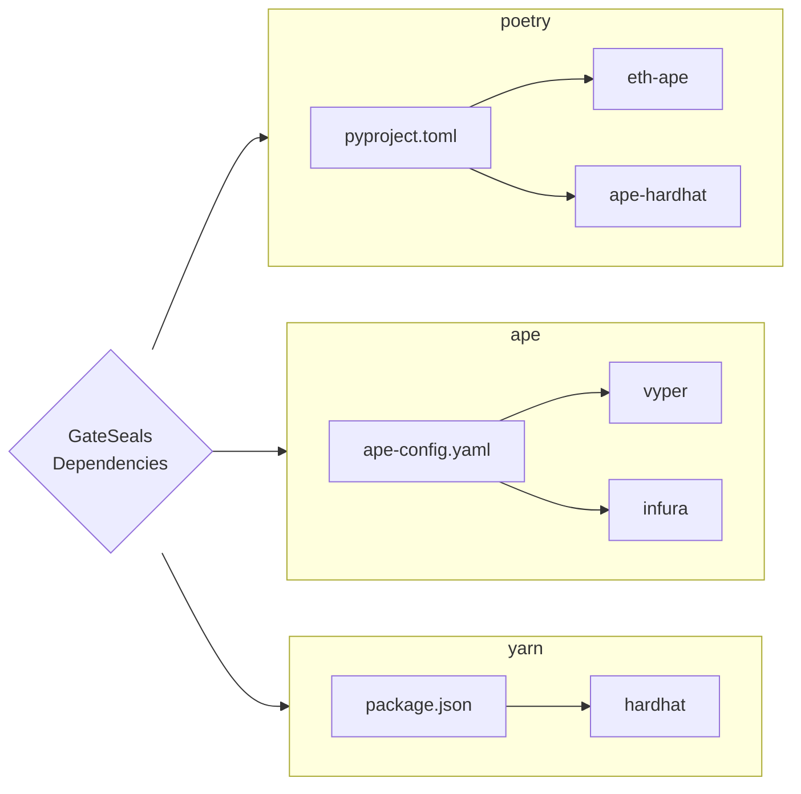

# GateSeal ⛩️

A one-time panic button for pausable contracts.


## What is a GateSeal?

A GateSeal is a contract that allows the designated account to instantly put a set of contracts on pause (i.e. seal) for a limited duration. GateSeals are meant to be used as a panic button for crucial contracts in case of an emergency. Each GateSeal is one-time use only and immediately becomes unusable once activated. If the seal is never triggered, the GateSeal will still eventually expire after a set period.

## Why use a GateSeal?

To put such crucial components of the Lido protocol as `WithdrawalQueue` and `ValidatorExitBus` on hold, the DAO must hold a vote which may take up to several days to pass. GateSeals provide a way to temporarily pause these contracts immediately if the emergency calls for a swifter response. This will give the Lido DAO the time to come up with a solution, hold a vote, implement changes, etc.

Each GateSeal is operated by a committee, essentially a multisig account responsible for pulling the break in case things go awry. However, authorizing a committee to pause/resume the protocol withdrawals would be utterly reckless which is why GateSeals have a number of safeguards in place:
- each GateSeal can only be activated only once and becomes unusable immediately after,
- each GateSeal can only be activated within its expiry period of 1 year maximum and becomes unusable past its expiry timestamp even if it was never triggered,
- the pause duration set at costruction time is limited to 14 days.

Thus, the biggest damage a compromised GateSeal multisig can inflict is to pause withdrawals for 14 days, given the DAO does not resume withdrawals sooner via the governance voting.

With all that said, it still is undesireable for a decentralized protocol to rely on a multisig in any capacity. Which is why GateSeals are only a temporary solution; their limited lifespan and one-time use design also act as a kind of "inconvenience bomb", in that once expired, the GateSeal must be replaced and setup anew.

## How does it work?

The idea of GateSeals is heavily based around [PausableUntil](/contracts/test_helpers/SealableMock.vy) contracts which both `WithdrawalQueue` and `ValidatorExitBus` implement. These PausableUntil contracts are similar to [Pausable](https://github.com/OpenZeppelin/openzeppelin-contracts/blob/release-v4.4/contracts/security/Pausable.sol) contracts with one important difference: the paused state is not merely a boolean value, but a timestamp from which the contract is resumed (or unpaused). This allows the user to pause the contract for a certain period, and after this period the contract will resume itself without an explicit call. Thus, the PausableUntil pattern in conjunction with a GateSeal provide a way to pull the break on the protocol in a critical situation.

A GateSeal is set up with an immutable configuration at the time of construction:
- the sealing committee, an account responsible for triggering the seal,
- the seal duration, a period for which the contracts will be sealed,
- the sealables, a list of contracts to be sealed,
- the expiry period, a period after which the GateSeal becomes unusable. 

Important to note, that GateSeals do not bypass the access control settings for pausable contracts, which is why GateSeals must be given the appropriate permissions beforehand. If and when an emergency arises, the sealing committee simply calls the seal function and puts the contracts on pause for the set duration. 

## How are GateSeals created?

GateSeals are created using the GateSealFactory. The factory uses the blueprint pattern whereby new GateSeals are deployed using the initcode (blueprint) stored onchain. The blueprint is essentially a broken GateSeal that can only be used to create new GateSeals.

While Vyper offers other ways to create new contracts, we opted to use the blueprint pattern because it creates a fully autonomous contract without any dependencies. Unlike other contract-creating functions, [`create_from_blueprint`](https://docs.vyperlang.org/en/stable/built-in-functions.html#chain-interaction) invokes the constructor of the contract, thus, helping avoid the initilization shenanigans.

The blueprint follows the [EIP-5202](https://eips.ethereum.org/EIPS/eip-5202) format, which includes a header that makes the contract uncallable and specifies the version. 

## Dependencies



## Contributing

### Prerequisites
This project was developed using these dependencies with their exact versions listed below:
- Python 3.10
- Poetry 1.1.13
- Node.js 16.14.2
- Yarn 1.22.19

Other versions may work as well but were not tested at all.

### Setup

1. Activate poetry virtual environment,
```shell
poetry shell
```

2. Install Python dependencies
```shell
poetry install
```

3. Install Node.js modules
```shell
yarn
```

4. (optional) set `MAINNET_RPC_ENDPOINT` environment variable for mainnet forking
```shell
export MAINNET_RPC_ENDPOINT=<your-mainnet-rpc-endpoint>
```

### Test

By default tests run on the local Hardhat network,
```shell
ape test
```

### Deploy

1. Set the deployer alias;
```shell
export DEPLOYER=<your-ape-account-alias>
```

2. Deploy the GateSeal blueprint and GateSealFactory;
```shell
ape run scripts/deploy_factory.py
```

3. Add the GateSeal configuration to environment variables.
- `FACTORY` - address of the GateSealFactory deployed in Step 1;
- `SEALING_COMMITTEE` - address of the sealing committee;
- `SEAL_DURATION_SECONDS` - duration of the seal in seconds;
- `SEALABLES` - a comma-separated list of pausable contracts;
- `EXPIRY_TIMESTAMP` - a unix epoch when GateSeal expires.

4. Deploy the GateSeal using the deployed factory
```shell
ape run scripts/deploy_gate_seal.py
```
