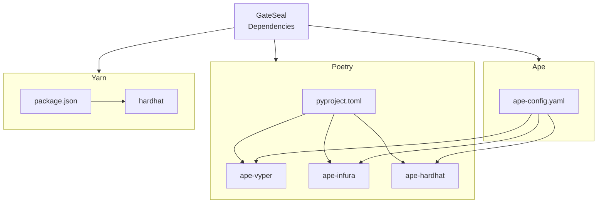

# GateSeal ⛩️

A one-time panic button for pausable contracts.
**Note:** This repository now uses Vyper 0.4.2 and the updated contracts `GateSealV2` and `GateSealFactoryV2`. The original `GateSeal` and `GateSealFactory` files remain for reference but are excluded from compilation.


## What is a GateSeal?

A GateSeal is a contract that allows the designated account to instantly put a set of contracts on pause (i.e. seal) for a limited duration. GateSeals are meant to be used as a panic button for crucial contracts in case of an emergency. Each GateSeal is one-time use only and immediately becomes unusable once activated. If the seal is never triggered, the GateSeal will still eventually expire after a set period.

## Why use a GateSeal?

To put such crucial components of the Lido protocol as `WithdrawalQueue` and `ValidatorExitBus` on hold, the DAO must hold a vote which may take up to several days to pass. GateSeals provide a way to temporarily pause these contracts immediately if the emergency calls for a swifter response. This will give the Lido DAO the time to come up with a solution, hold a vote, implement changes, etc.

Each GateSeal is operated by a committee, essentially a multisig account responsible for pulling the brake in case things go awry. However, authorizing a committee to pause/resume the protocol withdrawals would be utterly reckless which is why GateSeals have a number of safeguards in place:
- each GateSeal can only be activated once and becomes unusable immediately after,
- each GateSeal can only be activated within its expiry period and becomes unusable past its expiry timestamp even if it was never triggered,
- each GateSeal's immutable parameters (e.g., the pause duration) are specified by Tech and Analytics contributors and verified after deployment by internal and external auditors,
- each GateSeal can only be prolonged by the sealing committee,
- the total lifetime of a GateSeal across all prolongations is capped at 5 years maximum.


Thus, the biggest damage a compromised GateSeal multisig can inflict is to pause withdrawals for the configured duration, given the DAO does not resume withdrawals sooner via governance.


## How does it work?

The idea of GateSeals is heavily based around [PausableUntil](/contracts/test_helpers/SealableMock.vy) contracts which both `WithdrawalQueue` and `ValidatorExitBus` implement. These PausableUntil contracts are similar to [Pausable](https://github.com/OpenZeppelin/openzeppelin-contracts/blob/release-v4.4/contracts/security/Pausable.sol) contracts with one important difference: the paused state is not merely a boolean value, but a timestamp from which the contract is resumed (or unpaused). This allows the user to pause the contract for a certain period, and after this period the contract will resume itself without an explicit call. Thus, the PausableUntil pattern in conjunction with a GateSeal provide a way to pull the brake on the protocol in a critical situation.

A GateSeal is set up with an immutable configuration at the time of construction:
- the sealing committee, an account responsible for triggering the seal,
- the seal duration, a period for which the contracts will be sealed,
- the sealables, a list of contracts to be sealed,
- the expiry timestamp after which the GateSeal expires unless prolonged,
- the prolongation limit, the maximum number of allowed prolongations,
- the prolongation extension, the extra time added to the contract with each prolongation,
- the prolongation window, the active window during which the committee can prolong the contract,
- the pre-expiration offset, the time buffer for DAO Ops to deploy a new GateSeal before the current one expires.

Important to note, that GateSeal does not bypass the access control settings for pausable contracts, which is why GateSeal must be given the appropriate permissions beforehand. If the seal has not yet been triggered and has not expired, the sealing committee can call `prolong_lifetime` to extend the lifetime using one of the remaining prolongations. In an emergency the sealing committee simply calls `seal_all` or `seal_some` to immediately pause all configured sealables and expire the GateSeal.

## How are GateSeals created?
GateSealV2 is created using the GateSealFactoryV2. The factory uses the blueprint pattern whereby new GateSealV2 is deployed using the initcode (blueprint) stored onchain. The blueprint is essentially a broken GateSealV2 that can only be used to create new GateSealV2.

While Vyper offers other ways to create new contracts, we opted to use the blueprint pattern because it creates a fully autonomous contract without any dependencies. Unlike other contract-creating functions, [`create_from_blueprint`](https://docs.vyperlang.org/en/stable/built-in-functions.html#chain-interaction) invokes the constructor of the contract, thus, helping avoid the initialization shenanigans.

The blueprint follows the [EIP-5202](https://eips.ethereum.org/EIPS/eip-5202) format, which includes a header that prevents the contract from being called and specifies the version.

## Dependencies


```mermaid
flowchart TD
    subgraph Poetry
        direction LR
        apeVyper["ape-vyper"]
        apeInfura["ape-infura"]
        apeHardhat["ape-hardhat"]

        poetryConfig["pyproject.toml"]
        poetryConfig --> apeHardhat
        poetryConfig --> apeVyper
        poetryConfig --> apeInfura
    end

    subgraph Ape
        direction LR
        apeConfig["ape-config.yaml"]

        apeConfig --> apeVyper
        apeConfig --> apeInfura
        apeConfig --> apeHardhat
    end

    subgraph Yarn
        direction LR
        yarnConfig["package.json"]
        hardhat["hardhat"]
        yarnConfig --> hardhat
    end


    GateSeal["GateSeal
    Dependencies"]

    GateSeal --> Ape
    GateSeal --> Yarn
    GateSeal --> Poetry
```

## Contributing

### Prerequisites
This project was developed using these dependencies with their exact versions listed below:
- Python 3.10.13
- Poetry 2.1.3
- Node.js v22.16.0
- Yarn 1.22.22

Other versions may work as well but were not tested at all.

### Setup

1. Activate poetry virtual environment,
```shell
poetry shell
```

2. Install Python dependencies
```shell
poetry install
```

3. Install Node.js modules
```shell
yarn
```

4. Install ape plugins
```shell
ape plugins install .
```

5. (optional) set `MAINNET_RPC_ENDPOINT` environment variable for mainnet forking and deploying
```shell
export MAINNET_RPC_ENDPOINT=<your-mainnet-rpc-endpoint>
```

### Test

By default tests run on the local Hardhat network,
```shell
ape test
```

### Deploy

1. Set the deployer alias;
```shell
export DEPLOYER=<your-ape-account-alias>
```

2. Deploy the GateSealV2 blueprint and GateSealFactoryV2;
```shell
ape run scripts/deploy_factory.py
```

3. Add the GateSeal configuration to environment variables.
 - `FACTORY` - address of the GateSealFactoryV2 deployed in Step 1;
 - `SEALING_COMMITTEE` - address of the sealing committee;
 - `SEAL_DURATION_SECONDS` - duration of the seal in seconds;
 - `SEALABLES` - a comma-separated list of pausable contracts;
 - `EXPIRY_TIMESTAMP` - unix timestamp when the GateSeal expires;
 - `PROLONGATION_LIMIT` - prolongation limit;
 - `PROLONGATION_EXTENSION_SECONDS` – prolongation extension in seconds;
 - `PROLONGATION_WINDOW_SECONDS` – prolongation window in seconds;
 - `PRE_EXPIRATION_OFFSET` – prolongation window end offset before the expiration.

4. Deploy the GateSeal using the deployed factory
```shell
ape run scripts/deploy_gate_seal.py
```
